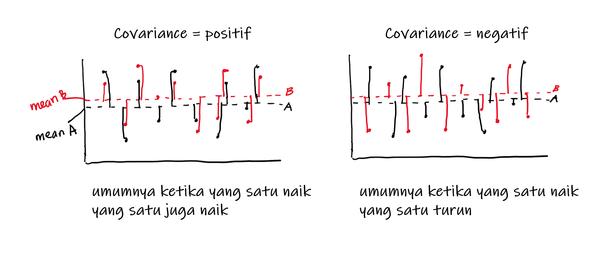
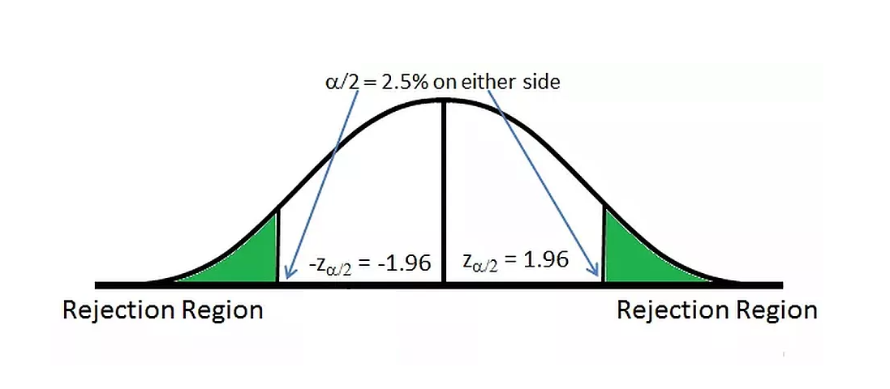
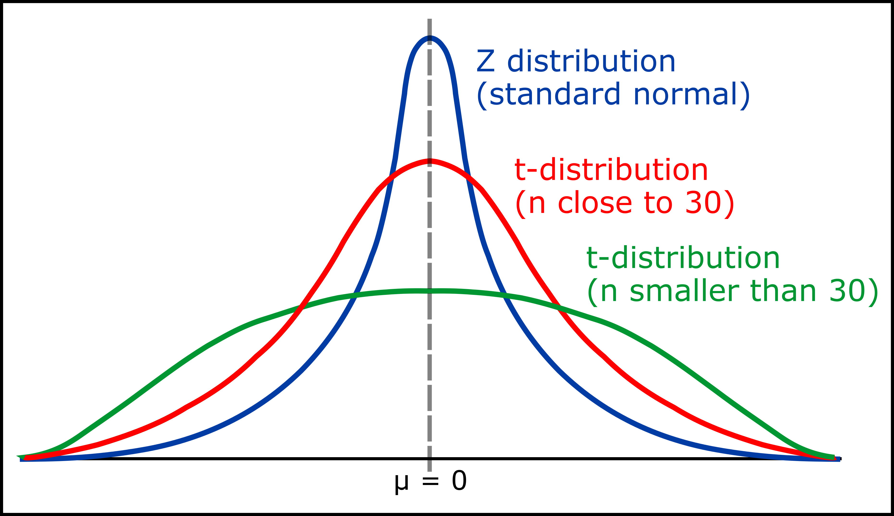

## Libraries and Setup
We'll set-up caching for this notebook given how computationally expensive some of the code we will write can get.
```{r setup}
options(scipen = 9999)
rm(list=ls())
```
```{r}
library(skimr)
library(dplyr)
```

Berikut adalah mindmap dari Practical Statistics yang akan kita pelajari:

```{r, out.width = "100%", echo = FALSE, fig.align = "center"}
knitr::include_graphics("image/PS.png")
```

# Descriptive Statistics
Statisticians and data scientists use descriptive statistics to summarize and describe a large number of measurements. Many times, this task is accompanied with graphs and plots that help describe the numerical summary of data. When data science is applied in the business context, an example of descriptive statistic is the average number of transactions per month. Another example is the percentage of e-commerce transactions with a voucher code applied. The simple rule is that descriptive statistics **do not involve generalizing beyond the data we have obtained, and are merely descriptive of what we have at hand**. The branch of statistics that deal with _drawing inferences about the larger population_ is called inferential statistics.

Let's start by reading in the `retail` dataset:
```{r}
retail <- read.csv("data_input/workshop.csv", sep=",",
                   fileEncoding = "ISO-8859-1", stringsAsFactors = F)
str(retail)
```
```{r}
retail [,1:2] <- lapply(retail[,1:2], as.Date)
retail[,c("Customer.ID","Product.Name")] <- lapply(retail[, c("Customer.ID", "Product.Name")], as.character)
```
```{r}
sum (retail$Profit/length(retail$Profit))
mean(retail$Profit)
```


# STUDI KASUS SUPERMARKET ANALISIS
**1. Business Question**
Pertumbuhan supermarket di kota-kota besar meningkat setiap tahunnya dan kompetisi pasar juga tinggi. Kita sebagai tim data scientist diminta untuk **menganalisa performa supermarket** milik perusahaan. Data tersimpan dalam `supermarket.RDS` berisi data transaksi selama periode Januari - Maret 2019. Data bersumber dari [Kaggle](https://www.kaggle.com/aungpyaeap/supermarket-sales).

** Read Data
```{r}
# read data
supermarket <- readRDS("data_input/supermarket.RDS")
```
Inspect data 
```{r}

glimpse(supermarket)
```

Deskripsi kolom:

* `invoice_id`: slip invoice id
* `branch`: branch supermarket (A, B, C)
* `city`: lokasi supermarket
* `customer_type`: tipe pelanggan (Member/Normal)
* `gender`: gender pelanggan
* `product_line`: kategorisasi produk (Electronic accessories, Fashion accessories, Food and beverages, Health and beauty, Home and lifestyle, Sports and travel)
* `unit_price`: harga produk dalam dollar
* `quantity`: jumlah produk yang dibeli pelanggan
* `tax_5`: harga pajak 5% untuk pembelian produk
* `total`: harga total termasuk pajak
* `date`: tanggal pembelian
* `purchase_hour`: jam pembelian
* `payment`: mode pembayaran (Cash, Credit card, Ewallet)
* `cogs`: harga pokok penjualan (cost of goods sold) 
* `gross_marginpct`: persentase margin penjualan
* `gross_income`: gross_income dari penjualan produk
* `rating`: rating pengalaman berbelanja pelanggan (1-10)

Kita akan analisis data `supermarket` dengan Descriptive Statistics dan Inferential Statistics. 

# Descriptive Statistics
Descriptive Statistics membantu kita **menggambarkan karakteristik** dari data, sehingga amat berguna dalam **eksplorasi data (EDA)** :
* Ukuran pemusatan data (measure of Central Tendency)
* Uuran penyebaran data 9Measure of Spread)
* Hubungan antar data (Variable Relationship)

## Measure of central Tendency
Ukuran pemusatan data adalah ** suatu nilai yang cukup untuk mewakili seluruh nilai pada data **

### Mean
Cara paling umum untuk membuat perkiraan nilai tunggal dari data yang banyak adalah dengan merata-ratakannya. 

* Formula: $\frac{\sum{x_i}}{n}$
* Fungsi pada R: `mean()`


**Contoh:**

Berapa `rating` supermarket?
```{r}
#hitung mean
mean(supermarket)
```

* Nilai mean **sensitif terhadap outlier**

> Outlier adalah nilai ekstrim yang jauh dari observasi lainnya. Nilai dapat membuat perhitungan mean menjadi tidak representatif.


Cek distribusi data rating:

```{r}

```

**Contoh**

Suatu perusahaan startup memiliki informasi pengeluaran bulanan pelanggan mereka. Perusahaan ingin mengetahui daya beli pelanggan. Berapa kisaran pengeluaran bulanan pelanggan mereka?

```{r}
# data
expense <- c(130, 5.8, 3.5, 3, 5.5, 4.5, 7.5, 5.5, 4, 2.8, 3)

# mean

```

Apakah rata-rata expense wajar? ...

```{r}
# cek distribusi data

```

Hal ini dapat diatasi dengan median!

### Median

Median atau nilai tengah diperoleh dengan mengurutkan data terlebih dahulu kemudian mencari nilai tengah dari data.

* Baik untuk data yang memiliki **outlier** atau berdistribusi **skewed** (condong kiri/kanan)
* Fungsi pada R: `median()`

Mari hitung ulang kisaran pengeluaran bulanan pelanggan:

```{r}
# median

```

```{r}
# cek distribusi data
# hist(expense, breaks = 50)
# abline(v = mean(expense), col = "red", lwd = 2)
# abline(v = median(expense), col = "blue", lwd = 2)
```

Kesimpulan: ...

Pilihan lain bila dengan menggunakan **trimmed mean**, yaitu rata-rata dengan terlebih dahulu memotong `x` persen nilai terkecil dan terbesar dari data:

```{r}
# trim 10%: hilangkan 1 data awal & 1 data akhir
mean(expense, trim = 0.1)
```

### Modus

Modus berguna untuk mencari nilai yang paling sering muncul.

* digunakan untuk data kategorik
* R tidak memiliki fungsi built-in

Fungsi DIY:

```{r}
most <- function(x){
  table_x <- table(x)
  name <- names(sort(table_x, decreasing = T))
  name[1]
}
```

**Contoh:**

`product_line` apa yang paling diminati oleh pelanggan?

```{r}

```

Bisa dilihat juga menggunakan fungsi `summary()`

```{r}

```

**Important Points:**

* bila data tidak ada outlier/berdistribusi normal gunakan ...
* bila data memiliki outlier/berdistribusi skewed gunakan ...
* bila data kategorik gunakan ...

## Measure of Spread

Ukuran penyebaran data mewakili seberapa menyebar atau beragam data kita.

### Variance

Variance menggabarkan seberapa data kita menyebar dari pusat datanya.

Formula variance: $var = \frac{\sum(X_i - \bar{X})^2}{n-1}$
Fungsi di R: `var()`

**Contoh:**

Perusahaan Startup sedang menseleksi daerah yang cocok untuk kantor baru mereka. Mereka memiliki informasi tentang harga sewa bangunan perkantoran di daerah A dan daerah B. 

```{r}
# data
harga_A <- c(400,410,420,400,410,420,400,410,420,400,410,420,400)
harga_B <- c(130,430,650,540,460,320,380,550,650,470,330,140,270)
```

Setelah dibandingkan, rata-rata harga bangunan kedua daerah sama:
```{r}
# rata-rata harga
mean(harga_A)
mean(harga_B)
```

Mari bandingkan dari sisi lain, yaitu tingkat keberagaman data (variance). Daerah manakah yang harganya lebih bervariansi?

```{r}
# cari nilai variance

```

Jawaban: ...

Note: 

* 
* 
* 

Daerah manakah yang lebih baik untuk dijadikan area perkantoran? ...

Note: Nilai variance bergantung pada skala data!

**Contoh:**

Di bawah ini, data mana yang lebih bervariasi?

```{r}
# data
luas_rumah <- c(100,100,90,90,90,100,100,90,100,100)
harga_sewa <- c(1,2,3,6,5,8,9,1,7,4) # dalam juta
```

```{r}
# cek variance

```

Note: ...

### Standard Deviation

Standard deviation menggambarkan **seberapa jauh simpangan nilai yang dianggap umum, dihitung dari titik pusat (mean) nya.** Kita dapat menentukan apakah suatu nilai dikatakan menyimpang dari rata-rata namun masih dikatakan umum, atau sudah tidak umum. 

Karena dihitung dengan **mengakarkan variance**, satuannya sudah sesuai dengan data asli dan bisa diinterpretasikan.

* Formula standar deviasi: $sd = \sqrt{var}$
* Fungsi di R: `sd()`

```{r}
# standar deviasi harga_A & harga_B

```

Interpretasi:

* 
* 

Apabila kita ditawarkan suatu bangungan di daerah B dengan harga 800, apakah harga tersebut masih wajar? Apakah sebaiknya kita membeli bangunan tersebut?

```{r}
# cek jarak nilai dari pusat data

```

Jawaban: ...

**DIVE DEEPER: Discuss!**

1. Standar deviasi umum digunakan untuk mengukur volatilitas saham. Dikumpulkan harga `saham_A` dan `saham_B` selama 20 periode terakhir.

```{r}
saham_A <- c(1000,1200,1150,1000,950,900,1200,1300,1400,1450,1500,1600,1400,1250,1400,1600,1700,1300,1400,1300)
saham_B <- c(1300,1350,1320,1310,1280,1230,1250,1260,1280,1300,1320,1340,1300,1270,1280,1300,1320,1400,1300,1290)
```

Andi adalah seorang investor pemula. Bantu Andi untuk menentukan saham mana yang lebih baik dia pilih untuk bermain investasi! Gunakan nilai **mean** dan **standar deviasi**.

Berapa rata-rata harga tiap saham?
```{r}

```

Saham mana yang memiliki volatilitas lebih tinggi?
```{r}

```

Jawaban: ...

Saham mana yang lebih baik Andi beli? Sertakan alasannya.

Jawaban: ...

2. Untuk masing-masing kasus di bawah, tentukan bagaimana kondisi ideal untuk nilai mean dan variancenya (tinggi/rendah):

**a.** Saya sebagai investor pemula tidak memiliki modal yang banyak untuk membeli saham dan ingin memilih saham dengan resiko rendah. Bagaimana keadaan harga saham yang saya harapkan?
 
* Mean: 
* Variansi: 

**b.** Saya sebagai tim pengajar di Algoritma tentunya ingin setiap student memperoleh score yang baik. Bagaimana keadaan score student yang saya harapkan? 

* Mean: 
* Variansi: 

**c.** Saya seorang student di Algoritma dan baru saja mengerjakan quiz practical statistics bersama teman-teman yang lain. Bagaimana keadaan score quiz yang saya harapkan?

* Mean: 
* Variansi:  

### Other Function

Untuk merangkum nilai sebaran data dapat menggunakan 5-number summary dengan fungsi `fivenum()` atau `summary()`:

Deskripsikan distribusi `gross_income` dari data supermarket! 

```{r}

```

```{r}

```

```{r}
# fungsi sebaran data lain:
min(supermarket$gross_income) # min data
max(supermarket$gross_income) # max data
IQR(supermarket$gross_income) # interquartile range (jarak Q1-Q3)
range(supermarket$gross_income) # menampilkan min dan max data
```

### Boxplot

Sebaran data lebih mudah divisualisasikan dengan **Boxplot**. Boxplot juga dapat menvisualisasikan **outlier**.

```{r, out.width = "100%", echo = FALSE, fig.align = "center"}
knitr::include_graphics("image/boxplot.png")
```

Komponen Boxplot:

* Box: Q1, Q2 (garis = median), dan Q3
* IQR: interquartile range; jarak Q1 ke Q3
* Whisker: pagar bawah & atas data (Q1-1.5IQR & Q3+1.5IQR) -> bukan min & max
* Data outlier: nilai ekstrim data, di luar pagar bawah dan atas (bisa termasuk min & max)

Note: Boxplot bisa mengindikasikan distribusi data:

* box yang berada ditengah = distribusi normal
* box yang mendekati daerah kiri/kanan (bawah/atas) = distribusi skewed
* bila median mendekati Q1 maka nilai pada data cenderung rendah.

**Contoh:**

Visualisasikan sebaran data `gross_income` dari data `supermarket`! Analisis informasi yang didapatkan.

```{r}

```

* Apakah data memiliki outlier? ...
* Bagaimana distribusi data? ...
* Central tendency mana yang baik dipakai untuk data ini? ...
* ...

Analisis sebaran data `gross_income` di tiap `purchase_hour` berikut. Distribusi data yang paling diharapkan jatuh pada jam berapa?

```{r}
boxplot(formula = gross_income ~ purchase_hour, data = supermarket)
```

Jawaban: ...

## Variable Relationship

Ukuran yang digunakan untuk melihat **hubungan linear** antara dua variabel numerik.

### Covariance

Covariance menunjukkan bagaimana variansi 2 data (variable yang berbeda) bergerak bersamaan. Bila yang pergerakannya serupa maka covariance positif, bila tidak serupa maka covariance negatif.

* Formula Covariance: $Cov(X, Y) = \frac{1}{n-1}\sum\limits^n_{i=1}(X_i - \mu_X)(Y_i - \mu_Y)$

* Fungsi di R: `cov()`

**Contoh**

Hitunglah covariance antara `saham_A` dan `saham_B`! Bagaimana hubungannya?

```{r}

```

covariance: ...

```{r, out.width = "100%", echo = FALSE, fig.align = "center"}

```

Kelemahan: Covariance tidak memiliki batasan nilai untuk mengukur kekuatan hubungan antar dua variabel, sehingga kita hanya bisa mengetahui apakah hubungannya positif atau negatif. Oleh karena itu, hadir **correlation**.

### Correlation

Correlation memampatkan nilai covariance yang dari -inf s.d +inf menjadi **-1 s.d 1** sehingga bisa diukur kekuatan hubungan antar data (variable).

* Formula Correlation: $Cor(X,Y) = \frac{Cov(X,Y)}{\sqrt{Var(X)Var(Y)}}$
* Fungsi di R: `cor()`
* Nilai korelasi: -1 sampai 1
  + -1: negatif kuat
  + 0: tidak berkorelasi
  + 1: positif kuat
* Semakin tinggi nilai korelasi, semakin bisa kita memprediksi nilai suatu variable, dengan nilai variable lainnya -> bila nilai yang variable A naik, variable B pasti naik.

**Contoh:**

Adakah korelasi antara `saham_A` dan `saham_B`, bagaimana hubungan dan kekuatannya?

```{r}

```

Jawaban: ...

Visualisasi korelasi dengan scatterplot:
```{r}
# scatter plot

```

Ilustrasi correlation:

```{r, out.width = "100%", echo = FALSE, fig.align = "center"}
knitr::include_graphics("image/correlation.png")
```
**Dive Deeper!**

Dena seorang investor dan memiliki modal untuk membeli dua saham sekaligus. Dena telah mengumpulkan data historis 5 saham potensial dan melihat pergerakannya:

```{r echo=F}
# generate random data
set.seed(100)
saham_C <- rnorm(n = 20, mean = 1000, sd = 8)
saham_D <- sample(saham_B)
saham_E <- saham_A+50

saham <- data.frame(saham_A,saham_B,saham_C,saham_D,saham_E)
```

```{r}

```

1. Saham dengan karakteristik seperti apa yang sebaiknya Dena beli:

a. antar saham berkorelasi/tidak berkorelasi: ...
b. saham memiliki variansi rendah/tinggi: ...

2. dengan mempertimbangkan **sebaran data menggunakan boxplot**, serta **korelasi antar saham**, pilih 2 saham yang paling baik untuk Dena beli!

```{r}
# boxplot

```

```{r}
# hitung korelasi

```

# Inferential Statistics

Inferential Statistics membantu kita **menarik kesimpulan tentang keseluruhan data (populasi) dengan menggunakan sebagian informasinya saja (sampel)**. Aplikasi inferensial statistik diantaranya:

* Quick Count Pemilu
* Quality Control
* Riset Obat

Setiap data memiliki distribusi. Distribusi data yang spesial dan berperan dalam inferential statistics adalah **distribusi normal**. Hal ini berdasar dari dicetuskannya **Central Limit Theorem**.

> semakin bertambahnya jumlah sampel yang diambil secara acak (random), maka distribusi sampel akan mengikuti distribusi normal.

```{r}
# density plot: 50 random data
# coba ubah 50 dengan angka lebih tinggi, distribusi akan semakin normal
x <-  rnorm(50,0,1)
plot(density(x))
```

## Normal Distribution

```{r, out.width = "100%", echo = FALSE, fig.align = "center"}
knitr::include_graphics("image/normal-distribution.jpg")
```

Karakteristik:

* kurva berbentuk lonceng; simetris
* luas area dibawah kurva = 1
* persebaran data:
  + 68% data berada di rentang +- 1 standar deviasi dari mean
  + 95% data berada di rentang +- 2 standar deviasi dari mean
  + 99.7% data berada di rentang +- 3 standar deviasi dari mean
* **Standar normal baku** adalah distribusi normal dimana mean = 0 dan standar deviasi = 1. 

Data yang mendekati distribusi normal dapat diasumsikan memiliki karakteristik yang sama dengan distribusi normal. 

Ketentuan ini dimanfaatkan untuk penghitungan inferensial statistik:

* Menghitung Probabilitas:
  + Probability Mass Function
  + Probability Density Function
* Membuat Confidence Interval
* Uji Hipotesis

## Probability Mass Function

* Menghitung peluang untuk data discrete:
  + kejadian hujan/tidak hujan
  + jumlah produk yang terjual

* Formula: jumlah kejadian terjadi/jumlah kejadian total

**Contoh:**

Dari data `supermarket`, berapa peluang pelanggan membeli produk dari `product_line` Health and Beauty?

```{r}

```

***


END OF DAY 1

Berapa `rating` supermarket? 6.9; cukup oke. Dapat ditingkatkan.

```{r}
# hitung mean
mean(supermarket$rating)
```

* Nilai mean **sensitif terhadap outlier**

> Outlier adalah nilai ekstrim yang jauh dari observasi lainnya. Nilai dapat membuat perhitungan mean menjadi tidak representatif.

Untuk cek distribusi data dan adanya nilai outlier dapat menggunakan histogram. Histogram memplotkan frekuensi per nilai yang terdapat pada variable tertentu.

```{r fig.height=4}
hist(supermarket$rating)
```

Insight: Distribusi cukup merata untuk seluruh nilai sehingga dapat digunakan mean. Bila kasusnya terdapat data outlier, akan berbahaya bila menggunakan mean.

**Contoh:**

Suatu perusahaan startup memiliki informasi pengeluaran bulanan pelanggan mereka. Perusahaan ingin mengetahui daya beli pelanggan. Berapa kisaran pengeluaran bulanan pelanggan mereka?

```{r}
# data
expense <- c(130, 5.8, 3.5, 3, 5.5, 4.5, 7.5, 5.5, 4, 2.8, 3)

# mean
mean(expense)
```

Apakah rata-rata expense wajar? Tidak. Nilai mean tidak mewakili data expense.

```{r fig.height=4}
# cek distribusi data
hist(expense, breaks = 50)
```

Insight: Terlihat terdapat outlier di nilai 130. 

Kekurangan mean yang sensitif terhadap outlier dapat diatasi dengan median!

### Median

Median atau nilai tengah diperoleh dengan mengurutkan data terlebih dahulu kemudian mencari nilai tengah dari data.

* Baik untuk data yang memiliki **outlier** atau berdistribusi **skewed** (condong kiri/kanan)
* Fungsi pada R: `median()`

Mari hitung ulang kisaran pengeluaran bulanan pelanggan:

```{r}
# median
median(expense)
```

```{r fig.height=4}
# cek distribusi data
# run chunk keseluruhan secara bersamaan
hist(expense, breaks = 50)
abline(v = mean(expense), col = "red", lwd = 2)
abline(v = median(expense), col = "blue", lwd = 2)
```

Insight: Pemusatan data expense lebih baik diwakilkan dengan nilai median.

Pilihan lain bila dengan menggunakan **trimmed mean**, yaitu rata-rata dengan terlebih dahulu memotong `x` persen nilai terkecil dan terbesar dari data:

```{r}
# trim 10%: hilangkan 1 data awal & 1 data akhir
mean(expense, trim = 0.1)
```

### Modus

Modus berguna untuk mencari nilai yang paling sering muncul.

* digunakan untuk data kategorik
* R tidak memiliki fungsi built-in

Fungsi DIY:

```{r}
most <- function(x){
  table_x <- table(x)
  name <- names(sort(table_x, decreasing = T))
  name[1]
}
```

Contoh penggunaan:

```{r}
most(supermarket$gender)
```

**Contoh:**

`product_line` apa yang paling diminati oleh pelanggan?

```{r}
most(supermarket$product_line)
```

Bila ingin ditinjau secara manual, bisa juga dilihat menggunakan fungsi `table()` atau `summary()`.

```{r}
summary(supermarket$product_line) # frekuensi terbanyak = Fashion Accecories
```

**Important Points:**

* bila data tidak ada outlier/berdistribusi normal gunakan mean
* bila data memiliki outlier/berdistribusi skewed gunakan median
* bila data kategorik gunakan modus

## Measure of Spread

Ukuran penyebaran data mewakili seberapa menyebar atau beragam data kita.

### Variance

Variance menggabarkan seberapa data kita menyebar dari pusat datanya.

Formula variance: $var = \frac{\sum(X_i - \bar{X})^2}{n-1}$
Fungsi di R: `var()`

**Contoh:**

Perusahaan Startup sedang menseleksi daerah yang cocok untuk kantor baru mereka. Mereka memiliki informasi tentang harga sewa bangunan perkantoran di daerah A dan daerah B. 

```{r}
# data
harga_A <- c(400,410,420,400,410,420,400,410,420,400,410,420,400)
harga_B <- c(130,430,650,540,460,320,380,550,650,470,330,140,270)
```

Setelah dibandingkan, rata-rata harga bangunan kedua daerah sama:

```{r}
# rata-rata harga
mean(harga_A)
mean(harga_B)
```

Mari bandingkan dari sisi lain, yaitu tingkat keberagaman data (variance). Daerah manakah yang harganya lebih bervariansi?

```{r}
# cari nilai variance
var(harga_A)
var(harga_B)
```

Jawaban: harga_B

Daerah manakah yang lebih baik untuk dijadikan area perkantoran? Tergantung kebutuhan.

* Daerah A karena bangunannya kemungkinan terstandarisasi dan ada di kompleks ruko yang rapih
* Daerah B karena terdapat opsi harga yang lebih rendah.

Note:

* Semakin besar variance, semakin beragam data
* Nilai variance: 0 - Inf
* Nilai tidak bisa diinterpretasikan langsung karena merupakan nilai kuadrat, hanya bisa membandingkan variance antar data.
* Variance yang diharapkan bisa kecil/besar, tergantung kebutuhan bisnis.
* Nilai variance bergantung pada skala data!

**Contoh:**

Di bawah ini, data mana yang lebih bervariasi?

```{r}
# data
luas_rumah <- c(100,100,90,90,90,100,100,90,100,100)
harga_sewa <- c(1,2,3,6,5,8,9,1,7,4) # dalam juta
```

```{r}
# cek variance
var(luas_rumah)
var(harga_sewa)
```

Note: Bila ada data yang rangenya berbeda bisa distandarisasi dahulu datanya sehingga range antar data sama atau tidak jauh berbeda. Caranya dapat menggunakan min-max normalization / scaling menggunakan `scale()`. Standarisasi data akan lebih detail dibahas di course machine learning.

### Standard Deviation

Standard deviation menggambarkan **seberapa jauh simpangan nilai yang dianggap umum, dihitung dari titik pusat (mean) nya.** Kita dapat menentukan apakah suatu nilai dikatakan menyimpang dari rata-rata namun masih dikatakan umum, atau sudah tidak umum. 

Karena dihitung dengan **mengakarkan variance**, satuannya sudah sesuai dengan data asli dan bisa diinterpretasikan.

* Formula standar deviasi: $sd = \sqrt{var}$
* Fungsi di R: `sd()`

```{r}
# standar deviasi harga_A & harga_B
sd(harga_A)
sd(harga_B)
```

Interpretasi:

* simpangan normal untuk harga_A adalah +- 8.62 dari rata-ratanya
* simpangan normal untuk harga_B adalah +- 169.42 dari rata-ratanya

Apabila kita ditawarkan suatu bangungan di daerah B dengan harga 800, apakah harga tersebut masih wajar? Apakah sebaiknya kita membeli bangunan tersebut?

```{r}
# cek jarak nilai dari pusat data
800-mean(harga_B)
```

Jawaban: Harga sudah menyimpang jauh (lebih besar dari simpangan normal atau standard deviation). Oleh karena itu bisa diwaspadai untuk tawaran ini. Jangan diterima langsung tawarannya. 

**DIVE DEEPER: Discuss!**

1. Standar deviasi umum digunakan untuk mengukur volatilitas saham. Dikumpulkan harga `saham_A` dan `saham_B` selama 20 periode terakhir.

```{r}
saham_A <- c(1000,1200,1150,1000,950,900,1200,1300,1400,1450,1500,1600,1400,1250,1400,1600,1700,1300,1400,1300)
saham_B <- c(1300,1350,1320,1310,1280,1230,1250,1260,1280,1300,1320,1340,1300,1270,1280,1300,1320,1400,1300,1290)
```

Andi adalah seorang investor pemula. Bantu Andi untuk menentukan saham mana yang lebih baik dia pilih untuk bermain investasi! Gunakan nilai **mean** dan **standar deviasi**.

Berapa rata-rata harga tiap saham?

```{r}
mean(saham_A)
mean(saham_B)
```

Saham mana yang memiliki volatilitas lebih tinggi?

```{r}
sd(saham_A)
sd(saham_B)
```

Jawaban: 

* saham_A -> volatilitas tinggi -> high risk
* saham_B -> volatilitas rendah -> low risk

Saham mana yang lebih baik Andi beli? Sertakan alasannya.

Untuk pemain saham yang baru, sebaiknya membeli saham dengan tingkat volatilitas rendah, yaitu saham B, karena pergerakkan harganya cukup stabil. Namun jika merasa sudah cukup memahami saham, bisa beralih ke saham A untuk mencari nilai keuntungan yang lebih bervariatif.

2. Untuk masing-masing kasus di bawah, tentukan bagaimana kondisi ideal untuk nilai mean dan variancenya (tinggi/rendah):

**a.** Saya sebagai investor pemula tidak memiliki modal yang banyak untuk membeli saham dan ingin memilih saham dengan resiko rendah. Bagaimana keadaan harga saham yang saya harapkan?
 
* Mean: rendah
* Variansi: rendah

**b.** Saya sebagai tim pengajar di Algoritma tentunya ingin setiap student memperoleh score yang baik. Bagaimana keadaan score student yang saya harapkan? 

* Mean: tinggi
* Variansi: rendah

**c.** Saya seorang student di Algoritma dan baru saja mengerjakan quiz practical statistics bersama teman-teman yang lain. Bagaimana keadaan score quiz yang saya harapkan?

* Mean: tinggi
* Variansi: tinggi (supaya saya termasuk yang dapat nilai tinggi, dan kompetitor (student lain) nilainya rendah ;') )

Opsi lain:

* Mean: tinggi
* Variansi: rendah (supaya saya dan semua teman saya nilainya bagus dan lulus :) ) 

Kondisi kasus C di atas tergantung keinginan sekenario Bapak/Ibu.

### Other Function

Untuk merangkum nilai sebaran data dapat menggunakan `summary()` atau 5-number summary dengan fungsi `fivenum()`.

**Contoh:**

Deskripsikan distribusi `gross_income` dari data supermarket! 

```{r}
summary(supermarket$gross_income)
```

```{r}
fivenum(supermarket$gross_income) # menampilkan semua nilai summary kecuali mean
```

```{r}
# fungsi sebaran data lain:
min(supermarket$gross_income) # min data
max(supermarket$gross_income) # max data
IQR(supermarket$gross_income) # interquartile range (jarak Q1-Q3)
range(supermarket$gross_income) # menampilkan min dan max data
```

### Boxplot

Sebaran data lebih mudah divisualisasikan dengan **Boxplot**. Boxplot juga dapat menvisualisasikan **outlier**.

```{r, out.width = "100%", echo = FALSE, fig.align = "center"}
knitr::include_graphics("image/boxplot.png")
```

Komponen Boxplot:

* Box: Q1, Q2 (garis = median), dan Q3
* IQR: interquartile range; jarak Q1 ke Q3
* Whisker: pagar bawah & atas data (Q1-1.5IQR & Q3+1.5IQR) -> bukan min & max
* Data outlier: nilai ekstrim data, di luar pagar bawah dan atas (bisa termasuk min & max)

Note:

* Banyaknya data dari Q1 ke nilai minimum (bukan pagar bawah) adalah 25%
* Banyaknya data dari Q1 ke Q2 adalah 25%
* Banyaknya data dari Q2 ke Q3 adalah 25%
* Banyaknya data dari Q1 ke Q3 (IQR) adalah 50%
* Banyaknya data dari Q3 ke nilai maksimum (bukan pagar atas) adalah 25%   
* Boxplot bisa mengindikasikan distribusi data:
  + box yang berada ditengah = distribusi normal (memadat di tengah)
  + box yang mendekati daerah kiri/kanan (bawah/atas) = distribusi skewed
  + bila median mendekati Q1 maka nilai pada data cenderung rendah.

**Contoh:**

Visualisasikan sebaran data `gross_income` dari data `supermarket`! Analisis informasi yang didapatkan.

```{r}
boxplot(supermarket$gross_income)
```

* Apakah data memiliki outlier? Ada. Kisaran 45 keatas. Data outlier bisa dibuang bila ditakutkan mengganggu pengolahan data/dianalisis lebih lanjut terkait karakteristiknya.
* Bagaimana distribusi data? Distribusinya skewed (condong ke bawah). Hmm.. berarti gross income kita tidak sebaik itu. Mungkin bisa ditingkatkan untuk strategi penjualannya.
* Central tendency mana yang baik dipakai untuk data ini? Median. Median juga bagus untuk distribusi data yang skewed (condong ke 1 arah).

Analisis sebaran data `gross_income` di tiap `purchase_hour` berikut. Distribusi data yang paling diharapkan jatuh pada jam berapa?

```{r}
boxplot(formula = gross_income ~ purchase_hour, data = supermarket)
```

Jawaban: 

* Jam 14.00 atau 19.00, karena memiliki median yang paling tinggi dibanding yang lain.
* Jam 14.00 memiliki sebaran data yang lebih bervariasi. Jam ini memiliki kemungkinan nilai maksimum yang lebih tinggi.
* Jam 19.00 memiliki sebaran data yang lebih konstan.

## Variable Relationship

Ukuran yang digunakan untuk melihat **hubungan linear** antara dua variabel numerik.

### Covariance

Covariance menunjukkan bagaimana variansi 2 data (variable yang berbeda) bergerak bersamaan. Bila yang pergerakannya serupa maka covariance positif, bila tidak serupa maka covariance negatif.

* Formula Covariance: $Cov(X, Y) = \frac{1}{n-1}\sum\limits^n_{i=1}(X_i - \mu_X)(Y_i - \mu_Y)$
* Fungsi di R: `cov()`

```{r, out.width = "100%", echo = FALSE, fig.align = "center"}

```

**Contoh:**

Hitunglah covariance antara `saham_A` dan `saham_B`! Bagaimana hubungannya? Positif.

```{r}
cov(x = saham_A, y = saham_B)
```

Kelemahan: Seperti variance, covariance tidak memiliki batasan nilai untuk mengukur kekuatan hubungan antar dua variabel (-inf s.d inf), sehingga kita hanya bisa mengetahui apakah hubungannya positif atau negatif. Oleh karena itu, hadir **correlation**.

### Correlation

Correlation memampatkan nilai covariance yang dari -inf s.d inf menjadi **-1 s.d 1** sehingga bisa diukur kekuatan hubungan antar data (variable).

* Formula Correlation: $Cor(X,Y) = \frac{Cov(X,Y)}{\sqrt{Var(X)Var(Y)}}$
* Fungsi di R: `cor()`
* Nilai korelasi: -1 sampai 1. Bila korelasi A & B mendekati..
  + -1 = negatif kuat -> bila A naik, B pasti turun.
  + 0 = tidak berkorelasi -> bila A naik, kita tidak tahu pasti apakah B akan naik/turun.
  + 1 = positif kuat -> bila A naik, B pasti naik.
* Semakin tinggi nilai korelasi, semakin bisa kita memprediksi nilai suatu variable menggunakan nilai variable lainnya.

**Contoh:**

Adakah korelasi antara `saham_A` dan `saham_B`, bagaimana hubungan dan kekuatannya?

```{r}
cor(x = saham_A, y = saham_B)
```

Jawaban: Positif lemah.

Visualisasi korelasi dengan scatterplot:

```{r}
# scatter plot
# run seluruh code bersamaan
plot(saham_A, saham_B)
abline(lm(saham_B ~ saham_A), # tambah garis;  linear model `lm` baru dibahas di Machine Learning
       col = 'red') # warna garis
```

Ilustrasi correlation:

```{r, out.width = "100%", echo = FALSE, fig.align = "center"}
knitr::include_graphics("image/correlation.png")
```
**Dive Deeper!**

Dena seorang investor dan memiliki modal untuk membeli dua saham sekaligus. Dena telah mengumpulkan data historis 5 saham potensial dan melihat pergerakannya:

```{r echo=F}
# generate random data
set.seed(100)
saham_C <- rnorm(n = 20, mean = 1000, sd = 8)
saham_D <- sample(saham_B)
saham_E <- saham_A+50

saham <- data.frame(saham_A,saham_B,saham_C,saham_D,saham_E)
```

```{r}
# inspect data
head(saham)
```

1. Saham dengan karakteristik seperti apa yang sebaiknya Dena beli:

a. korelasi antar saham: Tidak berkorelasi. Agar bila 1 turun, saham lain ga ikut turun.
b. saham memiliki variansi: Tergantung keinginan/kepribadian Bapak/Ibu, ingin mengambil yang high risk/low risk.

2. dengan mempertimbangkan **sebaran data menggunakan boxplot**, serta **korelasi antar saham**, pilih 2 saham yang paling baik untuk Dena beli!

```{r}
# boxplot
boxplot(saham)
```
```{r}
# buat matriks korelasi data
cor(saham)
```

Untuk visualisasi korelasi yang lebih apik dapat menggunakan fungsi `ggcorr()` dari package **GGally**:

```{r fig.height = 4}
# install package di console:
# install.packages("GGally")

# load library:
library(GGally)

# visualisasi:
ggcorr(saham, label = T)
```

Jawab: Bisa diambil saham E & D misalnya. Karena keduanya **tidak saling berkorelasi**, kedua saham memiliki **median yang cukup tinggi**. Selain itu, salah satu saham memiliki volatilitas yang lebih kecil (**nilainya stabil**) yaitu saham D (dilihat dari ukuran boxplot yang tidak lebar), sementara salah satunya memiliki volatilitas yang lebih tinggi sehingga menyediakan kemungkinan untuk mendapatkan keuntungan yang lebih variatif.

# Inferential Statistics

Inferential Statistics membantu kita **menarik kesimpulan tentang keseluruhan data (populasi) dengan menggunakan sebagian informasinya saja (sampel)**. Aplikasi inferensial statistik diantaranya:

* Quick Count Pemilu
* Quality Control
* Riset Obat

Setiap data memiliki distribusi. Distribusi data yang spesial dan berperan dalam inferential statistics adalah **distribusi normal**. 

## Normal Distribution

```{r, out.width = "100%", echo = FALSE, fig.align = "center"}
knitr::include_graphics("image/normal-distribution.jpg")
```

Karakteristik:

* kurva berbentuk lonceng; simetris
* luas area dibawah kurva = 1
* persebaran data:
  + 68% data berada di rentang +- 1 standar deviasi dari mean
  + 95% data berada di rentang +- 2 standar deviasi dari mean
  + 99.7% data berada di rentang +- 3 standar deviasi dari mean
* **Standar normal baku** adalah distribusi normal dimana mean = 0 dan standar deviasi = 1. 

Distribusi normal banyak digunakan pada inferensial statistik karena dicetuskannya **Central Limit Theorem**.

> Semakin bertambahnya jumlah sampel yang diambil secara acak (random), maka distribusi sampel akan mengikuti distribusi normal.

```{r}
# density plot: 50 random data
# coba ubah 50 dengan angka lebih tinggi, distribusi akan semakin normal
x <-  rnorm(5000,0,1)
plot(density(x))
```

Data yang mendekati distribusi normal dapat diasumsikan memiliki karakteristik yang sama dengan distribusi normal. Karakteristik distribusi normal dimanfaatkan untuk penghitungan inferensial statistik:

* Menghitung Probabilitas:
  + Probability Mass Function
  + Probability Density Function
* Membuat Confidence Interval
* Uji Hipotesis

## Probability Mass Function

* Menghitung peluang untuk data discrete:
  + peluang hujan/tidak hujan
  + peluang produk yang terjual
* Formula: jumlah kejadian terjadi/jumlah kejadian total

**Contoh:**

Dari data `supermarket`, berapa peluang pelanggan membeli produk dari `product_line` Health and Beauty?

```{r}
prop.table(table(supermarket$product_line))
```

Peluang pelanggan membeli product_line Health and Beauty adalah ...

## Probability Density Function

* Menghitung probability data continuous:
  + tinggi badan
  + curah hujan
  + pendapatan/keuntungan
* Memanfaatkan distribusi normal (standar normal baku)
* Tahapan:
  + hitung Z-score (ubah data ke standar normal baku = Z-score standarization)
  + hitung peluang berdasarkan Z-score
* Z-score: titik data pada distribusi normal baku.

$$Z = \frac{x-\mu}{\sigma}$$
Ket:

* Z = Z-score
* x = titik data
* $\mu$ = mean
* $\sigma$ = standar deviasi

**Contoh**

Tinggi badan pria dewasa di Indonesia berdistribusi normal dengan rata-rata 165 cm dan standar deviasi 10 cm. Berapa peluang pria dewasa di Indonesia memiliki tinggi badan >180 cm?

Diketahui:

* mean = 165
* stdev = 10
* titik data = >180

```{r}
# hitung Z-score
Z <- (180-165)/10
Z
# hitung peluang
pnorm(Z, lower.tail = F) * 100
```

Jawaban: Peluang pria dewasa di Indonesia memiliki tinggi badan >180 cm adalah ...

**DIVE DEEPER!**

Mari manfaatkan data `supermarket` yang kita punya. 

1. Setelah 3 bulan beroperasi, ingin dimanfaatkan data historis untuk keperluan budget planning. Perusahaan berniat untuk **memperkirakan kemungkinan keluarnya nilai HPP (`cogs`) tertentu**. 

Berikut kondisi-kondisi yang ingin dicari peluang kemunculannya:

a. Berapa peluang munculnya nilai `cogs` >500 ?

```{r}
# cari mean
mean_cogs <- mean(supermarket$cogs)
# == 307.5874

# cari standar deviasi
sd_cogs <- sd (supermarket$cogs)
```

```{r}
# cari z-score target

Z <- (500 - mean_cogs)/sd_cogs
Z
# cari peluang
pnorm(Z, lower.tail = F) 
```

Jawaban: 0.2056362 atau 20 %

b. Berapa peluang munculnya nilai `cogs` <100 ?

```{r}
Z_2 <- (100 -  mean_cogs)/sd_cogs
Z_2
pnorm(Z_2, lower.tail = T) 
```

Jawaban: 18%

c. Berapa peluang munculnya `cogs` di antara 150-500?

```{r}
Z_150 = (150-mean(supermarket$cogs))/sd(supermarket$cogs) 
Z_500 = (500-mean(supermarket$cogs))/sd(supermarket$cogs)
pnorm(Z_500,lower.tail = T) -pnorm(Z_150,lower.tail = T)
```

Jawaban: 54%

## Confidence Interval (CI)

Confidence interval (selang kepercayaan) berguna untuk menduga suatu nilai dengan sebuah interval (batas bawah, batas atas). Menebak dengan sebuah interval akan meminimalisir error dibandingkan hanya dengan menebak satu nilai.

* Formula: 

$$CI= \bar{x} \pm Z_{\frac{\alpha}{2}}*SE$$

* Ket: 
  + $\bar{x}$ = rata-rata sampel
  + $Z_{\frac{\alpha}{2}}$ = Z-score ketika alpha/2
  + $\alpha$ = tingkat error yang ditolerasi
  + tingkat kepercayaan = 1-$\alpha$
  + SE = standard error

SE mengukur kebaikan sampel dalam mewakilkan populasi. Semakin kecil, maka sampel semakin representatif (baik). 

$$SE = \frac{\sigma}{\sqrt n}$$
* Ket: 
  + $\sigma$ = standar deviasi sampel
  + $n$ = jumlah sampel

* Tahapan:
  + hitung mean sampel
  + hitung standar deviasi sampel & SE
  + tentukan tingkat kepercayaan & $\alpha$
  + hitung Z alpha/2
  + hitung confidence interval

**Contoh:**

Suatu perusahaan service laptop ingin memperkirakan rata-rata durasi service laptop dari perusahaannya untuk keperluan operasional. Perusahaan memiliki **300 data** durasi service laptop selama 3 bulan terakhir dengan rata-rata durasi **96,5** jam dan standar deviasi **22** jam.

Berapakah confidence interval untuk rata-rata durasi service laptop? Gunakan tingkat kepercayaan 95%.

Diketahui: 

mean = 96.5
stdev = 22
jumlah data (n) = 300

1. Hitung nilai SE

```{r}
SE <- 22/sqrt(300)
SE
```

2. Tentukan tingkat kepercayaan dan alpha -> 95% alpha =5% -->0.05


3. Hitung Z alpha/2

```{r}
Z_5 <- qnorm(0.025)
Z_5

```

4. Mendapatkan nilai CI

```{r}
96.5 + Z_5*SE
96.5 - Z_5*SE
```

Jawaban: durasi service laptop berkisar di ...

Note: 94.01051jam - 98.98949jam

## Uji Hipotesis

Uji hipotesis bertujuan untuk menguji **dugaan**. Uji hipotesis sering disebut juga sebagai **uji signifikansi** yang digunakan untuk menguji apakah suatu treatment memberikan perubahan/pengaruh signifikan terhadap suatu kondisi.

Istilah-istilah:

* Hipotesis: dugaan sementara yang harus diuji
  + $H_0$ / null hypothesis: 
    - kondisi standar
    - umumnya keadaan yang tidak diharapkan 
    - memiliki unsur kesamaan (=, >=, <=)
  + $H_1$ / alternate hypothesis: 
    - umumnya keadaan yang kita harapkan
    - kontradiktif dengan $H_0$

Contoh: 

* $H_0$:
  - Pemakaian masker tidak memberikan pengaruh pada laju penyebaran virus corona (=) 
  - Penambahan teknisi tidak memberikan perbedaan durasi servis laptop (>=)
  - Penerapan promo tidak memberikan perbedaan jumlah pembelian produk(<=)
* $H_1$:
  - Pemakaian masker memberikan pengaruh pada laju penyebaran virus corona (!=) 
  - Penambahan teknisi menurunkan durasi servis laptop (<)
  - Penerapan promo meningkatkan jumlah pembelian (>)
  
* $\alpha$:
  + tingkat signifikansi
  + umumnya 0.05
* $1-\alpha$: tingkat kepercayaan
* $p-value$:
  + akan dibandingkan dengan alpha untuk untuk mengambil keputusan
  + peluang data sampel berada pada bagian sangat ekstrim/berbeda signifikan dengan keadaan normal.
  
Pengambilan keputusan:

* Jika $p-value$ < $\alpha$, maka tolak $H_0$
* Jika $p-value$ > $\alpha$, maka gagal tolak $H_0$

**Contoh:**

### Z-test

Uji hipotesis yang menggunakan Z-test bila:

* standar deviasi populasi diketahui
* jumlah sampel banyak (n > 30)

**KASUS 1**

Lozy merupakan sebuah bisnis online yang bergerak di bidang fashion. Bila diketahui rata-rata likes dari suatu post di platform mereka sebesar **14000** likes dengan standar deviasi **5000** likes.

Demi meningkatkan likes dari tiap post, Lozy memutuskan untuk menggunakan influencer sebagai model pemasaran produk. Setelah menggunakan influencer, diambil **50** postingan acak yang ternyata memiliki rata-rata likes **15500**.

Sebagai tim marketing, analisis apakah influencer tersebut meningkatkan customer engagement (dari segi rata-rata likes) secara signifikan, atau tidak? Gunakan tingkat kepercayaan **95%**.

Jawab:

**a. Tentukan Hipotesis**

* $H_0$: dengan menggunakan influencer , mean likes dari postingan di platform sama
* $H_1$: dengan menggunakan influencer, mean likes dari postingan di platform naik

**b. Hitung Z-hitung & P-value**

Diketahui:

* mean populasi = 14000
* stdev populasi =  5000
* n = 50
* mean sampel = 15500 
* tingkat kepercayaan = 95% 
* alpha = 0.25

$Z = \frac{\bar X-\mu}{SE}$ 

$SE = \frac{\sigma}{\sqrt n}$

```{r}
# z-hitung
Z <- (15500 - 14000)/(5000/sqrt(50))
Z
```

```{r}
# p-value 
pnorm(Z, lower.tail = F)

```

```{r, out.width = "100%", echo = FALSE, fig.align = "center"}
knitr::include_graphics("image/p-value.PNG")
```

**c. Bandingkan P-value dengan alpha**

* alpha = 0.05
* p-value =0.01694743

Keputusan: 

Note: Tolak H0

**d. Kesimpulan**

 Dengan menggunakan influencer likes postingan Lozy naik siginifikan

**KASUS 2**

Sebuah pabrik susu bubuk melakukan pengecekan terhadap berat produk mereka. Sebelumnya diketahui bahwa rata-rata berat bersih susu adalah **1000 gram** (tertera pada label produk) dan standar deviasi sebesar **30 gram**. Diambil sampel sebanyak **100 kaleng** dari yang beredar di pasaran dan diperoleh rata-rata berat bersih sebesar **995 gram**. Apakah susu bubuk benar memiliki berat bersih sesuai dengan yang tertera? Ujilah dengan **tingkat signifikansi 5%**.

Jawab:

**a. Tentukan Hipotesis**

* $H_0$: 
* $H_1$: 

**b. Hitung Z-hitung & P-value**

Diketahui:

* mean populasi = 
* stdev populasi = 
* n = 
* mean sampel = 
* alpha = 

```{r}
# cari Z-hitung

```

```{r}
# cari P-value

```

**c. Bandingkan P-value dengan alpha**

Karena H1 dua arah (berbeda, lebih kecil atau lebih besar), alpha dibagi menjadi 2 untuk daerah ekstrim bawah dan ekstrim atas. 

```{r, out.width = "100%", echo = FALSE, fig.align = "center"}

```

* alpha = 
* p-value = 

Keputusan: 

**d. Kesimpulan**

 ...

### T-test

Uji hipotesis yang menggunakan T-test bila:

* standar deviasi populasi tidak diketahui
* jumlah sampel sedikit (n <= 30)

Bentuk T-distribution mirip dengan normal distribution, hanya saja lebih landai ketika jumlah sampel sedikit:

```{r, out.width = "100%", echo = FALSE, fig.align = "center"}

```

**Contoh:**

Quicker merupakan startup yang bertugas untuk membantu para startup lain mendapatkan dana hibah dari pemerintah. Umumnya, lama proses penyerahan berkas hingga dana dicairkan adalah **215 hari**. 

Dikumpulkan data durasi proses pencairan dana dari **10** perusahaan startup yang menggunakan jasa Quicker sebagai berikut: 

```{r}
duration <- c(201, 200, 215, 212, 246, 220, 205, 195, 190, 200)
```

Apakah Quicker bisa secara signifikan mempercepat durasi pencairan dana hibah Gunakan tingkat kepercayaan 97%.

Jawab:

**a. Tentukan Hipotesis**

* $H_0$: 
* $H_1$: 

**b. Hitung P-value dengan `t.test()`**

Untuk t.test R sudah memiliki fungsi built-in tersendiri:

```{r}
# t.test(data_sampel, mu = mean, alternative = dugaan_mean_sampel_di_H1)
t.test(duration, mu=215, alternative = "less")
```

**c. Bandingkan P-value dengan alpha**

alpha = ...
p-value = ...

Keputusan: 

**d. Kesimpulan**

 ...

***